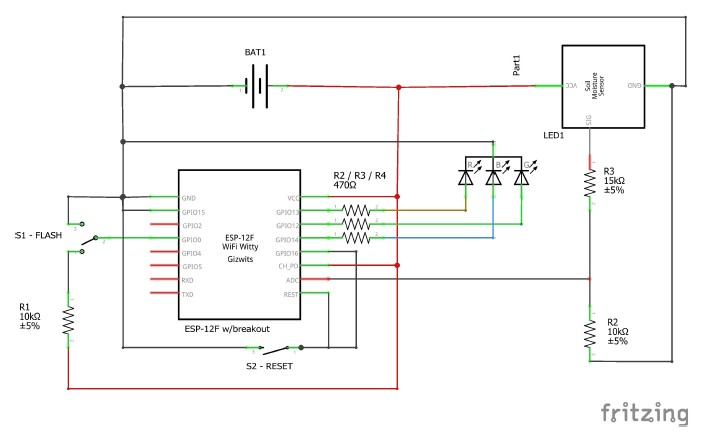

# Soil Moisture Sensor

This project is aimed to measure vegetable garden soil moisture.

## Features

* MQTT enable: Reports mositure levels using MQTT.

* Deep Sleep: The controllers enters deep sleep mode and wakes up every hour to measure and report the soil mositure. The reporting is done only if the soil moisture show a large change compared to previous measurements or if 4 hours period had elapsed. This reduces power comsumption and allows the device to run on a 18650 3000mAh for up to 2 weeks.

* OTA: Over the air update is enabled by default. In order to do an OTA update, the device shall be awake. Send the following MQTT command so it remains awake the next time it wakes up so OTA can be done:

Topic: /home-assistant/moist/A/request
Payload: 'a'

## Schemmatic

## Notes

In order to build this software add a file named secret.h at ./include and define the following constant strings:

const char * MQTT_BROKER_ADDRESS = "mqtt-server-address-or-fqdn";

const char * MQTT_USERNAME = "mqtt-user-name";

const char * MQTT_PASSWORD = "mqtt-user-password";
